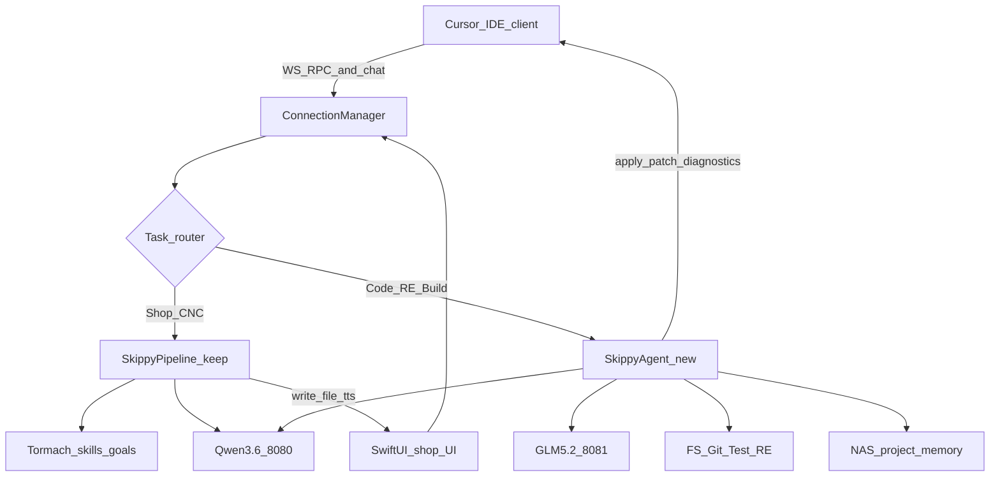

# Skippy Fable-Class Rebuild Plan

## Goal

Rebuild Skippy into a dual-runtime local agent that keeps the shop/CNC assembly line, and adds a Cursor-class coding + reverse-engineering agent: multi-file, multi-repo, multi-chat, project memory on the NAS — as close as possible to Fable 5 on a **512GB Mac Studio**, fully local at runtime.

**Out of scope:** Sonos mic hacking, cloud dependency for production inference, replacing shop tools.

---

## Hardware and infra you need

| Asset | Role |
|---|---|
| **512GB Mac Studio** | Inference + Skippy hub (already have) |
| **Synology NAS** | Chroma project memory, model weight archive, workspace mirrors |
| Fast local SSD | Active model weights + working git clones (NAS for cold storage) |
| **Cursor** (MacBook or Studio) | IDE hands via RPC / OpenAI-compat |
| Optional | USB/open mic for voice later; Era 300s as **speakers only** |

**Disk budget (approx):**
- GLM-5.2 MLX ~3.5bpw: ~330GB
- Qwen3-Coder-480B MLX 4bit (optional alt): ~270GB
- Qwen3.6-35B-A3B / 27B: ~20–40GB
- Project indexes + chroma: grows with repos

**Memory rule:** Only one heavy model resident. Typical: GLM-5.2 on `:8081` + small Qwen3.6 on `:8080`. For 1M-context GLM sessions, unload the fast model.

---

## Model use

### A) Models for *building* this rebuild (in Cursor)

| Phase | Model | Use |
|---|---|---|
| Architecture, contracts, hard refactors | **Claude Opus 5** (thinking high/xhigh) | Dual runtime, session store, patch protocol, hub concurrency |
| Implementation volume | **Claude Fable 5** | Tools, prompts, Cursor client, wiring, tests |
| Small fixes / prompt polish | Fable 5 fast (or Composer) | Cheap iteration |

**Builder rule:** Opus designs and lands skeletons; Fable fills and iterates. Switch to Opus when stuck on systems design.

### B) Models for *runtime* Skippy (local MLX)

| Port / role | Model | Replaces |
|---|---|---|
| `:8081` Heavy Worker | **GLM-5.2** MLX ~3.5bpw (`avlp12/GLM-5.2-Alis-MLX-Dynamic-3.5bpw` or equivalent) | Llama 3.1 405B |
| `:8080` Fast Router / Architect / triage | **Qwen3.6-35B-A3B** (or Qwen3.6-27B dense) | Llama 3.3 70B |
| `:8082` Compressor / RAG extract | Same Qwen3.6 (or dedicated small coder) | Qwen2.5-Coder-32B |
| Optional alt heavy | Qwen3-Coder-480B-A35B MLX 4bit | Swap with GLM for coding-only A/B tests |
| Voice (later) | Whisper + Kokoro; optional Moshi for S2S chat | unchanged initially |

**Retire:** Meta-Llama-3.1-405B once GLM-5.2 is stable.

**Serving:** Keep OpenAI-compatible `mlx_lm.server` / LM Studio MLX so Skippy only changes URLs + model names.

---

## Target architecture



### Keep
- [`skippy_factory.py`](skippy_factory.py) Shop/CNC/Software/Whiteboard assembly line
- Tormach, skills, goals, heartbeat (shop-scoped)
- `ConnectionManager` multi-client hub
- `/ws/factory`, `/transcribe`, NAS Chroma base path

### Add
1. **`SkippyAgent`** — continuous tool loop (Cursor-like), not one-blueprint → one-file
2. **Project sessions** — `project_id`, workspace roots, chat threads, decisions on NAS
3. **Coding toolbelt** — read/grep/list/apply_patch/run_tests/git/gh
4. **Cursor client** — `client_id=cursor` RPCs for multi-file apply + diagnostics
5. **RE mode** — binwalk/strings/objdump/rizin or Ghidra headless + notes to project memory
6. **Task router** — Shop → factory; Code/RE/Build → agent; ambiguous → ask or classify with Qwen3.6

---

## Phased delivery

### Phase 0 — Prep (you + Opus 5 planning chat)
- [ ] Confirm Studio chip (M2/M3 Ultra) and free disk (~400GB+ for GLM)
- [ ] NAS shares: `skippy_memory`, `skippy_models`, `skippy_workspaces`
- [ ] Download GLM-5.2 3.5bpw + Qwen3.6 to NAS; copy active weights to Studio SSD
- [ ] Stand up servers: Qwen3.6 `:8080`, GLM-5.2 `:8081`, compressor `:8082`
- [ ] Smoke test OpenAI-compat chat completions
- [ ] Freeze shop behavior: don’t break Tormach while rebuilding
- [ ] Opus 5: write ADRs for agent loop, patch format, session schema

**Exit:** Both models answering on localhost; shop Skippy still works on old 70B if needed.

### Phase 1 — Model cutover (Fable 5)
- [ ] Update [`skippy_factory.py`](skippy_factory.py) URLs/names: 70B→Qwen3.6, 405B→GLM-5.2, compressor→Qwen3.6
- [ ] Point COMPLEX/Developer Engineer path at GLM-5.2
- [ ] Raise `max_tokens` / history limits modestly for GLM path
- [ ] A/B: one complex coding task vs old 405B
- [ ] Unload 405B weights from daily use

**Exit:** Factory Engineer on GLM-5.2; triage on Qwen3.6; shop still green.

### Phase 2 — Coding Agent runtime (Opus skeleton → Fable fill)
New module e.g. `skippy_agent.py` (+ prompts in `prompts.py`):

Agent loop:
1. Load project session + recent thread
2. ReAct/tool loop until `done` or max steps
3. Tools: `read_file`, `grep`, `list_dir`, `apply_patch`, `run_terminal` (auth), `git_*`, `search_project_memory`, `save_decision`
4. Route hard generation to GLM-5.2; cheap tool planning to Qwen3.6
5. Emit multi-file patches, not single `skills/` scripts

Wire hub:
- Payload `mode: "Agent" | "RE" | "Shop" | ...`
- Router in `/ws/factory` or `/ws/agent`

**Exit:** Multi-file edit on a sample personal repo via WS without Cursor.

### Phase 3 — Project memory on NAS (Fable 5)
- [ ] Schema: `projects/{id}/meta.json`, chats, decisions, file touch list
- [ ] Chroma collections scoped per `project_id`
- [ ] Better ingest: path-aware chunks + optional tree-sitter/ctags symbols
- [ ] Compressor stays on `:8082` for large dumps
- [ ] Heartbeat can resume **project** tasks (not blank Shop-only ticks)

**Exit:** New chat on same project recalls prior decisions + relevant files.

### Phase 4 — Cursor integration (Opus contract → Fable extension)
Server RPCs (extend `execute_tool_on_client`):
- `get_workspace_roots`, `get_open_files`, `get_diagnostics`
- `apply_patches`, `create_file`, `run_task` / terminal bridge

Cursor/VS Code extension:
- Connect `ws://studio:8000/ws/factory?client_id=cursor`
- Apply patches in editor, return diagnostics
- Optional: also point Cursor’s own agent at local GLM for side-by-side

**Exit:** Skippy Agent edits a multi-file feature inside Cursor with test/diagnostic feedback.

### Phase 5 — Reverse engineering mode (Fable + Opus prompts)
- [ ] Install: `binwalk`, `rizin` or Ghidra headless, `llvm-objdump`
- [ ] Tools: `re_strings`, `re_binwalk`, `re_disasm`, `re_decompile_fn`, `re_save_notes`
- [ ] Mode prompts: map → extract → hypothesize → document (no shop skills funnel)
- [ ] Only authorized personal binaries / your firmware

**Exit:** End-to-end RE note pack for one of your binaries in project memory.

### Phase 6 — Hardening and shop coexistence
- [ ] Auth gates for terminal/git push/deploy
- [ ] Regression: Tormach + skills + goals still work
- [ ] Model swap scripts (GLM vs Qwen3-Coder A/B)
- [ ] Docs: how to start servers, which model for which mode
- [ ] Optional later: Moshi S2S chat lane; Sonos Era 300 **playback only**

---

## Key code touchpoints

| Area | Files |
|---|---|
| Hub / pipeline | [`skippy_factory.py`](skippy_factory.py) |
| Tools | [`tools.py`](tools.py) — add FS/git/RE; keep Tormach |
| Prompts | [`prompts.py`](prompts.py) — Agent + RE modes; relax skills-only QA for Agent |
| New | `skippy_agent.py`, `skippy_sessions.py`, `cursor_client/` (extension) |
| Legacy reference | [`skippy_api.py`](skippy_api.py) `read_file`/`write_file` primitives |

---

## What you need to buy / install / prepare

**Software**
- [ ] Latest `mlx-lm` (patched if required for GLM-5.2 int8 MLA-KV / 1M ctx)
- [ ] Cursor + ability to run a private extension (or VS Code fork of same RPC)
- [ ] `ripgrep`, `git`, `gh`
- [ ] RE: `binwalk`, `rizin` and/or Ghidra
- [ ] Optional: tree-sitter CLI / ctags

**Models (download)**
- [ ] GLM-5.2 MLX ~3.5bpw (primary heavy)
- [ ] Qwen3.6-35B-A3B or 27B MLX (fast)
- [ ] Optional: Qwen3-Coder-480B-A35B MLX 4bit for A/B

**NAS layout (suggested)**
```text
/Volumes/skippy_memory/chroma_db/     # existing + per-project collections
/Volumes/skippy_models/               # cold model store
/Volumes/skippy_workspaces/           # cloned personal repos
/Volumes/skippy_memory/sessions/      # project session JSON
```

**Cursor builder settings**
- Default implement: Fable 5
- Hard design threads: Opus 5
- Keep this plan + ADRs in repo or NAS for continuity across chats

---

## Success criteria (closest-to-Fable checklist)

1. Multi-file feature implemented in a real personal repo without manual file babying
2. Second chat days later continues with project memory
3. Works across 2+ repos in one session (search + edit)
4. Cursor shows patches + diagnostics from Skippy
5. RE mode produces structured notes on your binary
6. Shop/Tormach path unbroken
7. Fully local inference (no required cloud LLM at runtime)

---

## Risk notes

- **GLM + fast model memory:** watch unified memory; script model load/unload
- **Quality gap vs Fable 5:** local GLM won’t always match; agent loop + tests close the gap
- **Don’t force Agent through Shop QA `skills/` path** — that bottleneck kills multi-file work
- **Terminal tools:** keep human auth like `tormach_ssh` for destructive commands

---

## Suggested first week

| Day | Who | Work |
|---|---|---|
| 1 | You | Disk/NAS/models; GLM + Qwen3.6 serving |
| 2 | Fable 5 | Phase 1 cutover in factory |
| 3–4 | Opus 5 then Fable | Phase 2 agent loop + FS/git tools |
| 5 | Fable | Phase 3 session/memory MVP |
| 6–7 | Opus + Fable | Phase 4 Cursor RPC MVP |

After week 1 you should feel the largest jump: multi-file local agent on GLM with project continuity. RE and polish follow.
