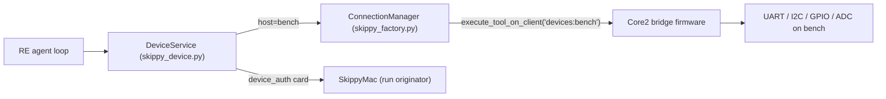

# Core 2 Build — M5Stack Core2 as a wireless bench IO node

Status: planned
Date: 2026-08-05
Hardware: M5Stack Core2 IoT Dev Kit v2 (Core2 + M5GO Bottom2 base)
Builds on ADR 0015 (RE live device I/O) and the `firmware/core2-voice` node.

## Goal and the seam it plugs into

Turn a Core2 into a permanent wireless bench node that Skippy's RE mode can
probe hardware through. The `host` parameter on the device tools already
routes anything non-local through `hub.execute_tool_on_client(bridge_client_id, ...)`
in `skippy_device.py`. We reuse that RPC channel, add a named-bridge scheme so
the Core2 coexists with a Mac bridge, put a token on `/ws/factory`, and add a
GPIO/I2C/ADC tool class for the pins a serial-only protocol cannot express.

The Core2 stays a dumb executor, exactly like the voice node: it performs
bridge actions and replies. Write-approval cards (`device_auth`) still go to
the client that started the run (SkippyMac), never to the Core2 — see
`DeviceService.approve_write` / `_request_auth` in `skippy_device.py`. So no
approval UI on the device.

## Bridge wire protocol (what the firmware implements)

Confirmed from `skippy_factory.py` (`execute_tool_on_client`, and the endpoint
loop's `task_id` routing to `hub.resolve_response`) and every `_remote()` call
site in `skippy_device.py`:

- The hub sends the bridge client a JSON object containing an `action` plus
  params and a `task_id`.
- The client replies with a JSON object echoing `task_id`, and either
  `{"ok": true, "result": {...}}` or `{"ok": false, "error": "..."}`.
- Binary payloads are hex strings (`write_hex`, `data_hex`), matching
  `_encode_payload` / `_decode_payload`.

Actions the firmware answers (the serial ones already exist server-side, so
serial needs zero server changes): `device_list`, `device_serial_open`,
`device_serial_io`, `device_serial_close`, plus the new `device_i2c_scan`,
`device_i2c_io`, `device_gpio`, `device_adc`. USB actions are answered with an
"unsupported on this node" error.

## Phase 1 — Server: named bridges + factory token

Files: `skippy_device.py`, `skippy_factory.py`.

1. **Named bridges.** Today `_remote()` always targets the single
   `self.bridge_client_id` (`"devices"`). Change routing so a non-local `host`
   maps to a bridge client id, e.g. `host="bench"` → `client_id="devices:bench"`,
   while `host="macbook"` keeps working. Bare `"devices"` stays valid for
   back-compat. A few lines in `DeviceService._remote()` plus the offline error
   message that currently hardcodes `client_id='devices'`.
2. **Factory token.** Mirror the voice lane's `_authorized()` in
   `skippy_voice.py`: add a `token` query param to `factory_endpoint` gated on
   a new `SKIPPY_FACTORY_TOKEN`, closing with code 1008 before accept on
   mismatch. This is what makes the permanent LAN bind the wireless node
   forces defensible — today `/ws/factory` has no auth and any non-reply
   message starts an agent run.
3. **Bridge role cannot start runs.** In the endpoint loop, treat a
   `client_id` beginning with `devices` as RPC-only: it may send `task_id`
   replies and `hello`, but a stray message must never reach `runner.start`.
   A compromised ESP32 must not be able to drive the agent.

## Phase 2 — New device tools for pins/bus (GPIO/I2C/ADC)

Serial maps 1:1 onto existing tools; pins and buses need new ones. Add to
`skippy_device.py`, following the existing reads-free/writes-ask pattern
(`approve_write` before any byte leaves):

- `i2c_scan(host, bus)` — read, free → bridge action `device_i2c_scan`
- `i2c_io(host, addr, register, write?, read_len)` — register read free; a
  write goes through `approve_write` → `device_i2c_io`
- `gpio_io(host, pin, mode, value?)` — read free; drive/set gated →
  `device_gpio`
- `adc_read(host, pin)` — read, free → `device_adc`

These are bridge-only: if `host` resolves local (the Studio has no GPIO),
return a clear "needs a hardware bridge node" error rather than attempting
pyserial/pyusb. Wire each into the `DEVICE_TOOLS` tuple in `skippy_device.py`,
`_ASYNC_TOOLS` in `skippy_dispatch.py`, and the schema dict in
`tool_schemas.py`. No agent-loop change — `re_tools()` already includes
`DEVICE_TOOLS`.

## Phase 3 — Firmware: `firmware/core2-devio/`

New PlatformIO project modeled on `firmware/core2-voice/` (reuse its
`platformio.ini` approach, `WebSocketsClient`, `ArduinoJson`, and `secrets.h`
handling). It connects as `client_id=devices:bench` with the token, sends
`hello`, then dispatches incoming `action`s and replies with `task_id`.

Pin map for the IoT Dev Kit v2 (standard Grove assignments):

- UART (`serial_*` tools): Port C — G13 RX / G14 TX (`Serial2`)
- I2C (`i2c_*` tools): Port A — G32 SDA / G33 SCL
- GPIO / ADC: Port B — G36 (ADC input) / G26 (GPIO/DAC output)

The 240x320 screen shows connection state and a scrolling log of each action
Skippy runs on the wires — a trust affordance for a node that accepts remote
hardware writes. Ship `secrets.h.example` (Wi-Fi, Studio LAN address,
`SKIPPY_FACTORY_TOKEN`) and a `README.md` like the voice node's, including the
levels caveat: Grove pins are 3.3V logic; 5V or RS-232 parts need a
shifter/transceiver.

## Phase 4 — ADR + prompt + tests

- **ADR 0020** in `docs/adr/`: the wireless bench bridge, named-bridge
  routing, the factory token (closing the auth gap ADR 0015's consequences
  flagged), the bridge-cannot-start-runs rule, and the new pin/bus tool class.
  It should pin the exact JSON shapes of the new bridge actions so firmware
  and server agree, the same way the serial actions are pinned today.
- **Prompt:** extend the RE device sentence in `prompts.py` (the "serial, USB,
  network" line in the RE system prompt) to mention I2C/GPIO/ADC and the
  `host=bench` node, keeping the "reads free, writes approved" framing.
- **Tests:** extend the device-tool tests with a fake bridge (in the spirit of
  `tests/fake_llm.py`) covering the new actions, the host-to-bridge-id
  mapping, local-host rejection for GPIO/I2C, and factory token accept/reject.
  Keep it import-light so CI (including the loopback-only netns run) stays
  green.

## Build order

1. Phase 3 as a firmware-only spike proving serial over `host="bench"`
   end-to-end, plus the minimal Phase 1 naming change it needs.
2. Factory token and bridge-role restriction (rest of Phase 1).
3. Phase 2 pins/bus tools, server and firmware sides together.
4. Phase 4 ADR, prompt line, tests.

## Notes

- The token is a shared secret in `secrets.h` on the device; that matches the
  voice node's existing posture and is the right scope here.
- Bounded request/response only — no persistent capture streams — per ADR
  0015. The Core2's capabilities match that constraint exactly.
